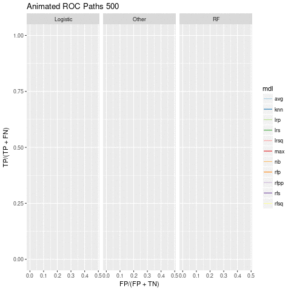

+++
title = "Severe Class Imbalance, md edition"
date = 2018-01-01T11:14:45-07:00
draft = false

# Tags and categories
# For example, use `tags = []` for no tags, or the form `tags = ["A Tag", "Another Tag"]` for one or more tags.
tags = ["R","machine-learning","emergent-reducibility"]
categories = []

preview = true

+++

Besides lots of family time and the creation of this blog/website, this is what I've been thinking about over the winter break.

# Background
As part of my research in *emergent reducibility*, I've had to face a binary classification situation with severe class imbalance. Among brute-force searches, it seems that there's roughly 1 case of emergent reducibility (what I'm looking for) for every 1 million irreducible cubic polynomials. It is known that there are infinitely many cubic polynomials with emergent reducibility. 

One standard way of dealing with class imbalance is to artificially increase the incidence of positive cases in the training data, but I've seen very little about how to decide how much to adjust the ratio of the two classes - that's what this post is about.

# Training Data
To examine the relationship of class imbalance on several classifiers, I build 21 training sets each with the same 52 cases
of emergent reducibility and between 500 and 2500 (by 100 increments) polynomials without emergent reducibility. Each training set was used to train a variety of logristic regression, random forest, naive Bayes, and k-nearest neighbor models via caret.

# Confusion Matrices
Once the models were trained, they were all tested against the same data set with 23 cases of emergent reducibility (no overlap with training data) and 8000 cases without emergent reducibility. For each model and training set combination, a confusion "matrix" was build, this is in the file {}confMats.csv{}. Let's read that into R and add another variable, *mdlType* that's either *logistic*, *RF*, or *other*. This is to facet some graphs later.

```r
confMats <- read.csv("../../static/post/confMats.csv", header=TRUE)

logLocations <- grep("lr", confMats$mdl)
rfLocations <- grep("rf", confMats$mdl)

confMats$mdlType <- vector(mode="character", length=length(confMats$mdl))

confMats[logLocations,]$mdlType <- "Logistic"
confMats[rfLocations,]$mdlType <- "RF"
confMats[!(1:length(confMats$mdl) %in% c(logLocations,rfLocations)),]$mdlType<-"Other"
```

# ROC Plots

Now we'll plot our confusion matrices in ROC space, each point is a model and training set combo. I've facetted by model type for readability.

```r 
library(ggplot2)

#11 distinct colors, courtesy of colorbrewer2.org
cb11<-c('#a6cee3','#1f78b4','#b2df8a','#33a02c','#fb9a99','#e31a1c','#fdbf6f','#ff7f00','#cab2d6','#6a3d9a','#ffff99')
ggplot(confMats,aes(x=FP/(FP+TN),y=TP/(TP+FN),col=mdl))+geom_point()+facet_wrap(~mdlType)+scale_color_manual(values=cb11)+ggtitle("ROC Plots of Models and Class Imbalance ")

```

The model *max* seems to find the most, but this simply marks a polynomial as having emergent reducibility if any other model says it does. This indicates some models find cases that others miss (I have some nice heatmaps showing this also, for another day). The logistic regression models have much more irregular variation than I was expecting. 

To see how varying the number of non-emergent reducibile polynomials impacts performs, I'll throw in some animation:

```r
library(gganimate)

pathPlot <- ggplot(confMats,aes(x=FP/(FP+TN),y=TP/(TP+FN),col=mdl,frame=ner))+geom_path(aes(cumulative=TRUE, group=mdl))+facet_wrap(~mdlType)+scale_color_manual(values=cb11)+ggtitle("Animated ROC Paths")

gganimate(pathPlot, "pathPlot.gif")
```

